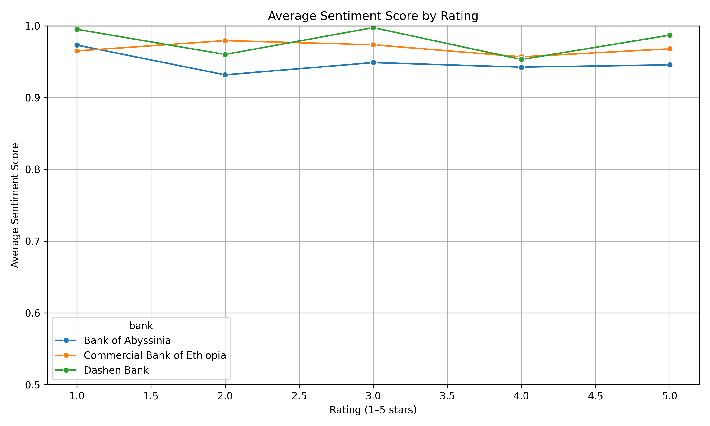
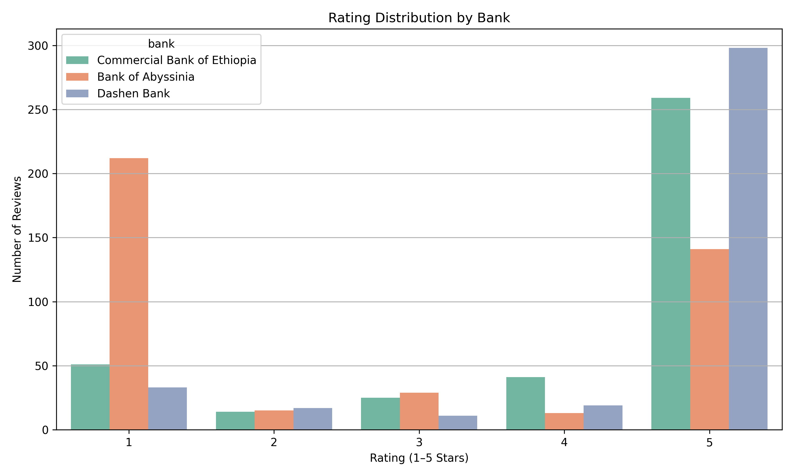

# 📊 Week 2 – Insights Summary: Omega Banking Review Analysis

**Date:** June 8, 2025  
**Prepared by:** Miskir Besir Abshir

---

## 🔍 Objective

This analysis explores customer feedback for three major Ethiopian banking apps—**Commercial Bank of Ethiopia (CBE)**, **Dashen Bank**, and **Bank of Abyssinia (BOA)**—sourced from Google Play reviews. We aim to extract insights about user sentiment, satisfaction drivers, and pain points to inform product improvement recommendations.

---

## 📈 Key Insights

### ✅ Top Satisfaction Drivers

| Driver                     | Evidence (Keywords/Trends)                                                      | Affected Banks          |
| -------------------------- | ------------------------------------------------------------------------------- | ----------------------- |
| **Smooth User Experience** | Keywords like _“good”_, _“nice”_, _“easy”_, _“great”_ dominate positive reviews | All (esp. CBE & Dashen) |
| **Speed & Performance**    | _“fast”_, _“works well”_, _“responsive”_ frequently appear in Dashen reviews    | Primarily Dashen        |
| **Brand Confidence**       | Branding terms like _“CBE”_, _“super app”_, _“Dashen”_ cited positively         | CBE, Dashen             |

---

### ⚠️ Common Pain Points

| Pain Point                 | Evidence (Keywords/Negative Trends)                        | Affected Banks            |
| -------------------------- | ---------------------------------------------------------- | ------------------------- |
| **Crashes & Bugs**         | Words like _“crash”_, _“bug”_, _“not working”_             | BOA, some CBE             |
| **Login & Access Issues**  | _“login problem”_, _“not open”_, _“slow to load”_          | CBE, BOA                  |
| **Unclear Error Feedback** | Reviews indicating frustration without clear app messaging | All banks, especially BOA |

---

## 📊 Visualizations

-   
  _Higher sentiment correlates with higher star ratings, especially for Dashen._

-   
  _Dashen has higher counts of 5-star reviews, BOA shows more variance._

-   
  _CBE and Dashen skew heavily positive, BOA has more mixed feedback._

-   
  _Common terms: “good”, “app”, “fast”, “work”, “nice”, “super app”._

---

---

## 🧠 Themes Summary Table

| Theme                    | Description                                                  | Banks Frequently Mentioned |
| ------------------------ | ------------------------------------------------------------ | -------------------------- |
| **Login Problems**       | Users report login failures, errors, and authentication bugs | CBE, BOA                   |
| **App Performance**      | Comments on speed, responsiveness, and uptime                | Dashen, CBE                |
| **User Experience**      | General praise or criticism of interface, navigation, design | All banks                  |
| **Functionality Issues** | Features not working as expected (e.g., transfers, balance)  | BOA, CBE                   |
| **Positive Branding**    | Praise for apps as “super app”, trust in bank branding       | Dashen, CBE                |

## 💡 Recommendations

1. **Improve Login & Authentication Flows**

   - Add biometric options, reduce crashes on login.
   - Ensure consistent loading performance across devices.

2. **Implement Feedback Loop**

   - Provide in-app responses to failed operations.
   - Use push messages to inform users of fixes or downtime.

3. **Invest in UI/UX Personalization**
   - Dashen’s success with _“super app”_ branding shows opportunity in UI consistency and expansion.

---

## ⚖️ Ethical Considerations

- Google Play reviews can be **biased toward extreme experiences** (very positive or very negative).
- Some reviews are vague or low effort (“good”, “bad”)—limiting thematic depth.
- Language mix or sarcasm could mislead even advanced sentiment models.

---
